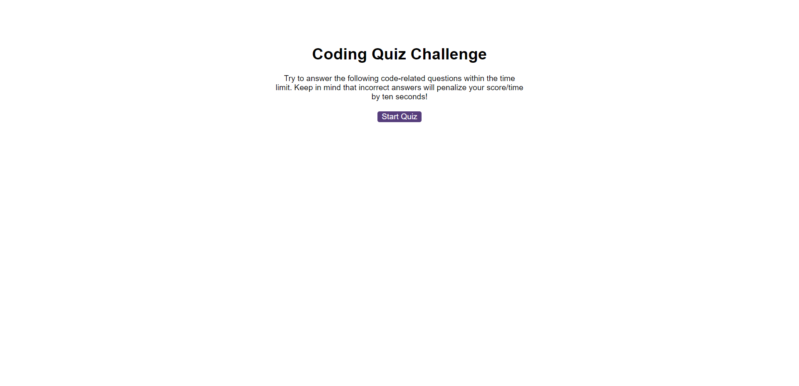

# Coding Quiz Challenge

## Description

Coding Quiz Challenge is a web-based multiple-choice quiz that tests the user's knowledge of basic coding concepts. The user has 75 seconds to answer a set of questions, and for each incorrect answer, 10 seconds are subtracted from the timer. At the end of the quiz, the user's score is displayed and the user can save their initials and score to view later.

## Features

- Timer that counts down from 75 seconds.
- Multiple-choice questions with immediate feedback.
- Ability to save initials and score at the end of the quiz.
- Highscores page to view previous scores.

## Usage

Follow the [link](https://willguille.github.io/code-quiz/)

## License

Please refer to the LICENSE in the repo.